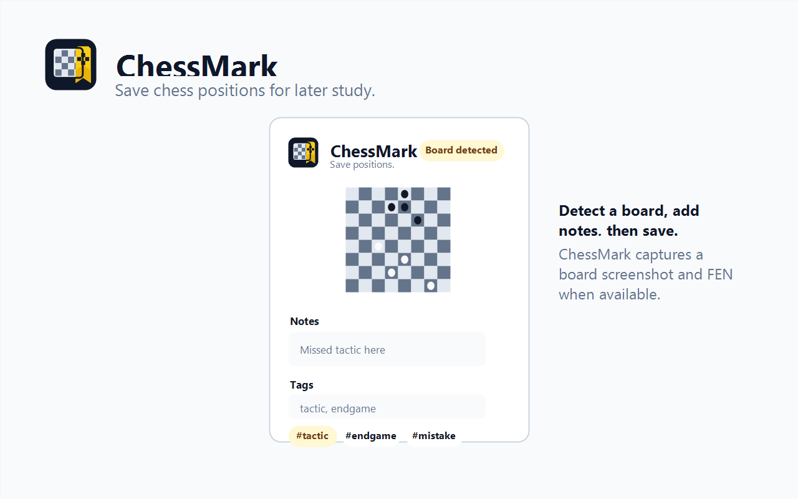
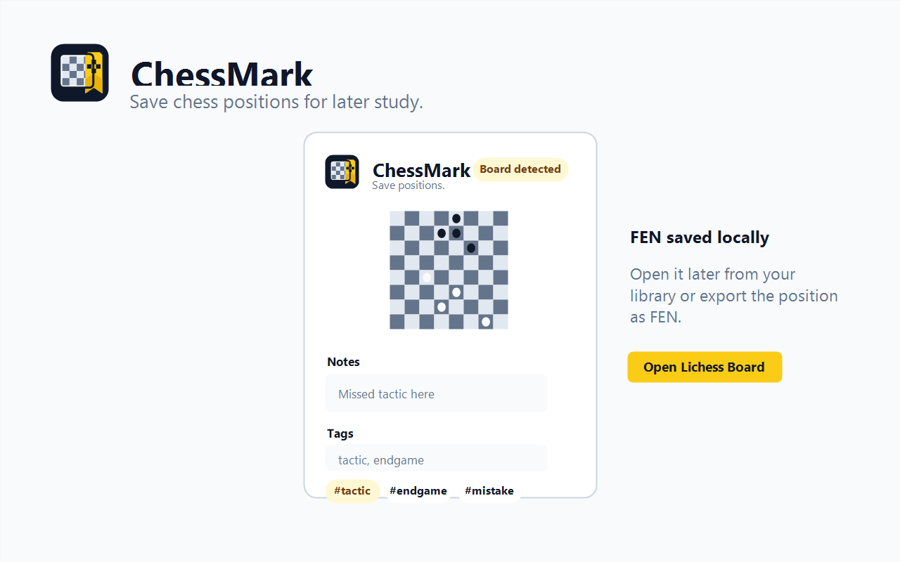
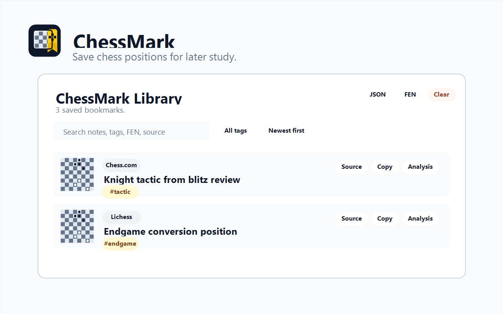

# ChessMark

ChessMark is a local-first Chrome/Chromium extension for bookmarking chess positions from Chess.com and Lichess.

It is built for the moment when you see a position worth remembering and want to save it quickly: a missed tactic, an instructive endgame, a strange pawn structure, a blunder, a coaching question, or a position you want to analyze later.

ChessMark is a bookmarking tool, not a chess engine. It does not provide evaluations, best moves, hints, analysis lines, or gameplay assistance.

## What It Does

- Detects visible chess boards on Chess.com and Lichess.
- Shows a compact preview of the detected board in the extension popup.
- Saves the current board position as a local bookmark.
- Captures a cropped screenshot of the board.
- Attempts to save FEN when available.
- Reconstructs FEN from visible board pieces when direct FEN is unavailable.
- Allows screenshot-only bookmarks when FEN cannot be captured.
- Lets users add notes and tags while saving.
- Provides reusable quick tags for fast categorization.
- Stores all bookmarks locally in the browser.
- Provides a full library page for searching, filtering, sorting, editing, opening, copying, deleting, and exporting bookmarks.

## Screenshots

### Board Detection



### Saved Position



### Library Management



## Supported Sites

ChessMark currently supports:

- Chess.com
- Lichess

The extension only activates on:

- `https://www.chess.com/*`
- `https://lichess.org/*`

## Capture Flow

When the user opens the extension popup on a supported site:

1. ChessMark checks whether a board is visible.
2. The popup shows a simple status:
   - `Checking`
   - `Board detected`
   - `No board`
   - `Error`
3. If a board is detected, ChessMark shows a small board preview.
4. The user can add notes and tags.
5. The user clicks **Save Position**.
6. ChessMark saves a new bookmark with screenshot, source URL, timestamp, tags, notes, and FEN when available.

Multiple positions from the same game can be saved. Each capture creates a separate bookmark with its own ID and timestamp.

## Position Data

ChessMark captures positions in this order:

1. Direct FEN from page data, URL data, attributes, scripts, or inputs when available.
2. DOM reconstruction from visible pieces and board geometry.
3. Screenshot-only fallback when FEN cannot be captured.

Bookmarks remain useful even when FEN is unavailable because the board screenshot is still saved.

## Quick Tags

ChessMark includes quick tags for fast categorization:

- `#tactic`
- `#endgame`
- `#mistake`

Users can also type comma-separated tags such as:

```txt
opening, coach, pawn-structure, ruy-lopez, italian-game, sicilian-defense, french-defense
```

This makes quick tags useful for saving specific openings a player is working on, such as the Ruy Lopez, Italian Game, Sicilian Defense, or French Defense.

Typed tags are saved locally as reusable quick tags. The library also includes a quick tag preset editor for adding or removing stored tags.

Quick tags are available in:

- The popup save flow.
- The library edit view.
- The library filter dropdown.

## Library Features

The ChessMark Library is a full extension page for managing saved positions.

It includes:

- Table view by default.
- Optional card view.
- Large readable board thumbnails.
- Useful generated titles instead of generic page titles.
- Notes preview.
- Visible tags on every bookmark.
- `no tags` placeholder when a bookmark has no tags.
- Source site label.
- Date saved.
- Search by title, note, tag, FEN, source URL, source title, and player metadata.
- Filter by tag.
- Sort by date:
  - Newest first
  - Oldest first
- Edit notes and tags.
- Delete individual bookmarks.
- Clear all local bookmarks.
- Copy FEN.
- Open the original source URL.
- Open the saved position in an analysis board when FEN is available.
- Export all bookmarks as JSON.
- Export saved FEN positions as text.

## Analysis Links

ChessMark can reopen saved FEN positions on analysis boards.

For Chess.com bookmarks, it creates:

```txt
https://www.chess.com/analysis?fen=...
```

For Lichess bookmarks, it creates:

```txt
https://lichess.org/analysis/standard/...
```

The library button is labeled **Analysis** for both sites. ChessMark does not analyze the position itself; it only opens the saved position on the source site's board.

## Data and Privacy

ChessMark is local-first.

- No backend server.
- No account required.
- No analytics.
- No remote uploads.
- Screenshots and positions are stored locally with `chrome.storage.local`.
- Users can delete individual bookmarks.
- Users can clear all bookmarks.
- Users can export their data.

See [ChessMark Privacy Policy](docs/privacy-policy.md). The published Chrome Web Store privacy policy URL is:

https://ctl0v0.github.io/Chessmark/privacy-policy

## Fair Play Positioning

ChessMark is designed as a private bookmark and study-recall tool.

It does not include:

- Chess engines.
- Stockfish.
- Evaluation bars.
- Best move suggestions.
- Move recommendations.
- Hints.
- Blunder detection.
- Gameplay automation.
- Clock or opponent-time advice.

The intended use is saving positions for later review.

## Browser Support

Current target:

- Chrome / Chromium browsers
- Manifest V3

Firefox support is not included yet.
